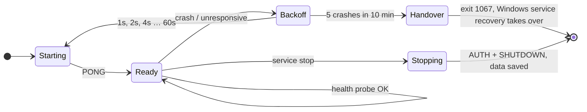
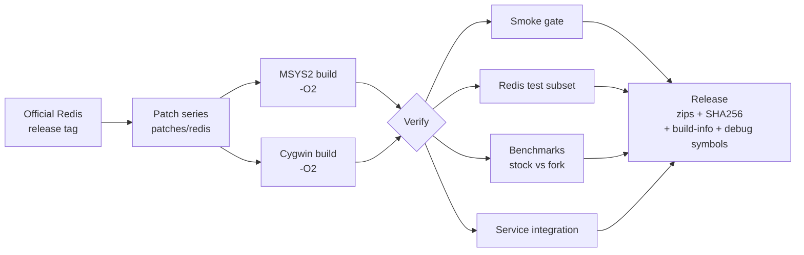

<div align="center">

<picture>
  <source media="(prefers-color-scheme: dark)" srcset=".github/assets/banner-dark.svg">
  <source media="(prefers-color-scheme: light)" srcset=".github/assets/banner-light.svg">
  
</picture>

<br>

[](https://github.com/ahmedawachi/redis-windows/actions/workflows/verify.yml)
[](https://github.com/ahmedawachi/redis-windows/releases)
[](https://github.com/redis/redis/releases/tag/8.10.2)
[](#60-second-setup)
[](#how-its-built)
[](#the-service-wrapper)
[](LICENSE)
[](https://github.com/ahmedawachi/redis-windows/releases)

**Redis for Windows, built from the official source, compiled with optimizations, run by a service that heals itself, and hardened against the out-of-memory crash that takes the stock build down.**

**[Website & live benchmarks](https://ahmedawachi.github.io/redis-windows/)** · [Why](#why-this-fork) · [Highlights](#highlights) · [60-second setup](#60-second-setup) · [How it's built](#how-its-built) · [Roadmap](#roadmap) · [Docs](#documentation) · [Contributing](#contributing)

</div>

---

## Why this fork

[redis-windows](https://github.com/redis-windows/redis-windows) does the hard part: it builds every official Redis release for Windows under MSYS2 and Cygwin and ships a Windows service to run it. Running it under real production load exposed two problems:

1. **The binaries were compiled with `-O0`, meaning no compiler optimization at all.** The build passes it in `CFLAGS`, which lands after Redis's own `-O3` and overrides it for Redis and every bundled library.
2. **A single refused allocation took the server down, and nothing brought it back.** Windows declined to commit memory for a ~1.9 MB reply buffer while the dataset was only ~64 MB. Redis aborted, as it always does when `malloc` fails. The service wrapper noticed, logged a warning, and kept reporting *Running*, so Windows' own service recovery never kicked in. The cache stayed down for over half an hour.

This fork fixes both, and everything found while tracing them. Each change is small, documented and tested, so the whole series can be offered back upstream.

## Highlights

<table>
<tr>
<td width="50%" valign="top">

### ⚡ Optimized build
Compiled at `-O2` (upstream ships `-O0`), without LTO or CPU-specific flags so it runs on any x64 host, including Hyper-V guests in compatibility mode. In the macOS proxy run published on the [benchmark page](https://ahmedawachi.github.io/redis-windows/benchmarks.html), pipelined small commands ran **1.6–1.95× faster** with **1.6–1.9× less CPU per command**, and background saves finished **1.7–2.2× sooner**. Multi-MB values, bound by memory copies, came out even. Windows numbers come from the benchmark job.

</td>
<td width="50%" valign="top">

### 🛡️ Soft out-of-memory handling
When Windows refuses memory for a **client buffer**, the fork disconnects that one client instead of killing the server. Clients such as StackExchange.Redis simply reconnect. Allocations that protect your data (keyspace, persistence, replication) still stop the server, exactly as before.
<br>`oom-soft-client-buffers yes` · `client_oom_disconnections`

</td>
</tr>
<tr>
<td valign="top">

### 🔁 A service that heals itself
The rewritten `RedisService.exe` supervises `redis-server`. It restarts it after a crash with exponential backoff, probes its health, and caps crash loops by exiting so Windows service recovery takes over. It shuts down with an authenticated `SHUTDOWN` that actually saves your data, and a Job Object makes sure Redis never outlives the service.

</td>
<td valign="top">

### 📏 Memory numbers you can trust
On stock Windows builds `used_memory_rss` just repeats `used_memory`, and the "Fork CoW" line Redis logs after each snapshot always says 0 MB. The fork reports the real figures from Windows: process private bytes, working set, and system commit total and limit. It also writes the host's commit state into the log if an allocation is ever refused.

</td>
</tr>
<tr>
<td valign="top">

### ✂️ No multi-MB reply blocks
Large replies to network clients are assembled from blocks of at most 256 KB instead of one contiguous allocation the size of the value. That exact kind of allocation was the one Windows refused. The bytes on the wire are unchanged.
<br>`reply-node-max-bytes`

</td>
<td valign="top">

### 🧱 Descriptor-limit guard
The `select()` event loop on these runtimes overwrites memory once a descriptor reaches `FD_SETSIZE` (1024), yet `maxclients` was allowed to reach 3,168. The fork clamps `maxclients` to what the event loop can safely handle and logs that it did.

</td>
</tr>
</table>

### Fork vs. upstream

| | Upstream | This fork |
|---|---|---|
| Compiler optimization | `-O0` | `-O2`, no LTO, portable x64 |
| Crash of `redis-server` | logged, service keeps saying *Running* | restarted with backoff; a crash loop hands over to Windows service recovery |
| Service stop | the wrapper sends a malformed command, then force-kills Redis after 5 s | authenticated `SHUTDOWN` (password and TLS aware) with a configurable timeout |
| Refused client-buffer allocation | whole server aborts | that client is disconnected, the server stays up |
| Memory reporting | RSS and fragmentation are placeholders | real Windows private bytes, working set and system commit |
| `maxclients` above 1024 on `select()` | silent memory corruption | clamped and logged |
| Releases | every new Redis tag auto-published as *latest* | new tags build as pre-releases; releases are deliberate |
| Verification | build plus one `SET`/`GET` | smoke gate, Redis test subset, baseline-vs-fork benchmarks, service integration tests |

## Status

> [!NOTE]
> Everything below is implemented and passes its tests on macOS, where the Redis test suite and the service's unit tests run. **The first Windows run of the verification workflow is pending**, so anything marked 🧪 has not been measured on Windows yet.

| Area | State |
|---|---|
| `-O2` build on MSYS2 and Cygwin | 🧪 awaiting the first Windows CI run |
| Redis patch series (7 patches) | ✅ applies to 8.10.2 and 8.10.1 · ✅ Redis test suites pass · 🧪 Windows-only paths |
| Self-healing service | ✅ 246 unit tests, 0 failures · 🧪 Windows service integration test |
| Benchmarks, stock vs. fork | 🧪 results land here after the first run |

## 60-second setup

No installer, no .NET, no admin rights needed to try it.

1. **Download** `Redis-<version>-fork.<n>-Windows-x64-msys2-with-Service.zip` (for example `Redis-8.10.2-fork.1-Windows-x64-msys2-with-Service.zip`) from [Releases](https://github.com/ahmedawachi/redis-windows/releases).
2. **Unblock and unzip.** Right-click the zip → **Properties** → tick **Unblock** → **OK**, then extract it anywhere. Unblocking first stops Windows SmartScreen from asking about every file. Avoid folders named `bin` or `usr`.
3. **Double-click `RedisService.exe`.** A window opens and Redis runs on `127.0.0.1:6379`. It shows where your data is saved and how to connect. If something is wrong, such as port 6379 already in use, the window stays open and says why.
4. **Try it:** double-click `redis-cli.exe` and type `PING` → `PONG`.
5. **Stop it:** press **Ctrl+C**, or close the window. Redis saves and shuts down cleanly. Closing the window gives it a few seconds, which is plenty for a development dataset; use Ctrl+C for a big one.

**Setting up a production server?** Follow the **[admin guide](docs/ADMIN-GUIDE.md)**: download to production in one path, every command included, with a sign-off checklist.

**Want it running in the background, starting with Windows?** Move the folder somewhere permanent, such as `C:\Redis`, and double-click **`install-service.bat`**. It asks for admin rights, installs the `Redis` service with its data in the `data` folder next to it, and starts it. **`uninstall-service.bat`** removes the service again and keeps your data.

> [!TIP]
> Out of the box Redis listens only on this machine (`127.0.0.1`), so nothing is exposed to the network. For production, start from [`conf/redis.windows-cache.conf`](conf/redis.windows-cache.conf) and set a password.

<details>
<summary><b>Command line, production installs, upgrades</b></summary>

Install with your own config and folders from an elevated prompt:

```powershell
C:\Redis\releases\8.10.2-fork.1\RedisService.exe install --service-name Redis -c C:\Redis\conf\redis.conf --dir C:\Redis\data
```

Run it in a console with explicit options:

```powershell
RedisService.exe run --foreground -c C:\Redis\conf\redis.conf
```

The first Ctrl+C stops Redis gracefully; a second forces it. `RedisService.exe --help` lists every option. Upgrades and rollbacks install side by side from another versioned folder and keep the previous version on disk; see [`docs/OPERATIONS.md`](docs/OPERATIONS.md).

</details>

<details>
<summary><b>Running <code>redis-server.exe</code> directly</b></summary>

`RedisService.exe` handles paths for you. If you start `redis-server.exe` yourself, write Windows paths with forward slashes, on the command line and inside `redis.conf` alike:

```cmd
redis-server.exe C:/Redis/conf/redis.conf --dir C:/Redis/data
``` The zip without the service also has `start.bat`, which runs Redis with the bundled `redis.conf`.

</details>

## The service wrapper



`RedisService.exe` is plain C# on .NET 10, published as one self-contained, trimmed executable. Double-clicked with no arguments, it runs Redis in its own window. Every option upstream offered still works. The new ones (restart policy, stop timeout, health probing, virtual service account and more) are listed by `RedisService.exe --help` and documented in [`docs/OPERATIONS.md`](docs/OPERATIONS.md).

## How it's built



Everything runs on GitHub Actions. **Actions → Manual Build Redis → Run workflow** takes a Redis version (`redis_version`), a fork revision (`fork_revision`), an optimization level (`optimization`, default `-O2`), TLS on/off (`build_tls`) and the release type (`prerelease`, `make_latest`), and produces a release tagged `<redis version>-fork.<revision>`:

- `…-msys2.zip` and `…-cygwin.zip`, each with or without the service
- a `-debug` zip with unstripped binaries for crash analysis
- a `build-info` file recording the exact compiler, runtime and patches used

New upstream Redis tags are picked up automatically and built as **pre-releases**. Nothing becomes *latest* without a deliberate release. The patch series and how to test each patch are described in [`patches/redis/README.md`](patches/redis/README.md).

## Roadmap

**Shipping now:** the optimized build, the seven Redis patches, the self-healing service, double-click setup, and the verification pipeline.

**Next**
- [ ] First Windows benchmark results, published in this README
- [ ] Zero-copy replies for large hash field values (removes the large allocation entirely)
- [ ] Allocator tuning for the MSYS2/Cygwin `malloc`, so freed multi-MB blocks are reused instead of committed afresh
- [ ] Socket-pair notifiers in place of pipes, removing a polling thread from every event-loop wait
- [ ] Profile-guided optimization trained on real workloads

**Later**
- [ ] A native Winsock event backend, in place of the runtime's emulated `select()`
- [ ] Snapshots without `fork()`, which the MSYS2/Cygwin runtimes emulate by copying the whole process

**Exploring**
- 🦀 **A Redis-protocol-compatible server written in Rust, natively for Windows, fully open source.** No POSIX emulation layer, no `fork()`, native I/O completion ports. It would start from the commands real Windows deployments use most (strings, hashes, expiry, LRU eviction, RESP2/RESP3) and grow from there. This is an idea we want to explore, not a commitment yet; if it interests you, open a discussion.

The full, reasoned plan, including what is deliberately *not* being done and why, is in [`docs/ROADMAP.md`](docs/ROADMAP.md).

## Documentation

| Document | What's inside |
|---|---|
| [`docs/ADMIN-GUIDE.md`](docs/ADMIN-GUIDE.md) | **start here to set up a server:** download to production, step by step, with a sign-off checklist |
| [`docs/OPERATIONS.md`](docs/OPERATIONS.md) | install, upgrade and rollback, monitoring, alerting, security-release policy, incident checklist |
| [`docs/ROADMAP.md`](docs/ROADMAP.md) | every change with its reasoning, what's deferred, what still needs a Windows measurement |
| [`patches/redis/README.md`](patches/redis/README.md) | the Redis patch series: what each patch does, its config and INFO fields, how to test it |
| [`conf/redis.windows-cache.conf`](conf/redis.windows-cache.conf) | a commented, production-minded config for cache workloads |
| [`docs/LICENSING.md`](docs/LICENSING.md) | licenses of this repo, of Redis 8, and of the bundled runtime |
| `scripts/collect-host-evidence.ps1` | read-only collector for memory, pagefile, event log and service facts after an incident |
| `scripts/redis-watchdog.ps1` | interim watchdog for hosts still running the upstream wrapper |
| `install-service.bat` · `uninstall-service.bat` | double-click service install and removal (in the `-with-Service` zip) |

## Contributing

Issues and pull requests are welcome. The house rules keep the fork easy to merge upstream:

- **One concern per patch.** A Redis patch lives in `patches/redis/` with a header that says what it does and why, and comes with a test.
- **Portable first.** Code that only matters on Windows sits behind `__CYGWIN__` and must not change behaviour on other platforms.
- **Measure, don't guess.** A performance change comes with before-and-after numbers from the benchmark job.

Found a security issue? Please report it privately through [GitHub security advisories](https://github.com/ahmedawachi/redis-windows/security/advisories/new) rather than a public issue.

## Credits

- [redis-windows](https://github.com/redis-windows/redis-windows), the project this fork builds on, and its maintainers.
- [Redis](https://github.com/redis/redis), and the [MSYS2](https://www.msys2.org) and [Cygwin](https://cygwin.com) projects whose runtimes make it run on Windows.

## License

The service wrapper and the build tooling in this repository are licensed under the [Apache License 2.0](LICENSE). Redis itself is licensed by Redis Ltd. under your choice of RSALv2, SSPLv1 or AGPLv3, and the patches in [`patches/redis/`](patches/redis/) apply to that source. Release zips also contain the MSYS2/Cygwin runtime and OpenSSL, each under its own license. [`docs/LICENSING.md`](docs/LICENSING.md) has the details.

<sub>Redis is a registered trademark of Redis Ltd. Any rights therein are reserved to Redis Ltd. This project is not affiliated with, endorsed by, or sponsored by Redis Ltd. Redis officially supports Linux; builds from this repository are community-maintained, so test them against your own workload before relying on them in production.</sub>

<div align="right">

English | [简体中文](README.zh_CN.md)

</div>
